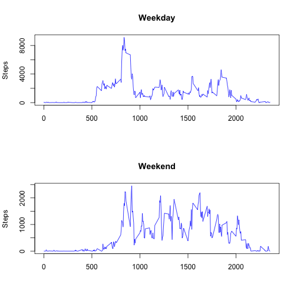

# Reproducible Research: Peer Assessment 1


## Introduction

This is an analysis of data from a personal activity monitoring device.  The device collects data at 5 minute intervals through out the day. The data consists of two months of data from an anonymous individual collected during the months of October and November, 2012 and include the number of steps taken in 5 minute intervals each day.

## Loading and preprocessing the data


```r
steps_df = read.csv("activity.csv")
```


## What is mean total number of steps taken per day?

We start with a histogram of the steps taken by per day.


```r
steps_by_day = aggregate(steps_df$steps, list(data = steps_df$date), sum)$x
hist(steps_by_day, breaks = 20, main = "Total steps taken each day", xlab = "Total Steps")
```

 


And then compute the mean and median:


```r
mean(steps_by_day, na.rm = TRUE)
```

```
## [1] 10766
```


```r
median(steps_by_day, na.rm = TRUE)
```

```
## [1] 10765
```


## What is the average daily activity pattern?

We take the mean for each interval across all days and then create a times series plot of
the averages for each interval.


```r
steps_by_interval = aggregate(. ~ interval, data = steps_df, mean)
plot(steps_by_interval$steps, type = "l", ylab = "Avg Number of Steps", xlab = "5-min Interval", 
    main = "Time Series Plot of 5-Min Intervals")
```

 


We then find the 5-min interval that, on average, contains the maximum number of steps.


```r
max_steps = max(steps_by_interval$steps)
max_steps_interval = steps_by_interval[steps_by_interval$steps == max_steps, 
    ]$interval
```


**Interval 835** is the interval with the most steps on average with **206.1698 steps**.

## Imputing missing values


```r
num_rows = length(steps_df$interval)
num_rows_not_na = length(na.omit(steps_df)$interval)
num_rows_na = num_rows - num_rows_not_na
```


The dataset has 17568 rows, of which 2304 have NAs.

We will fill each in with the mean for that day.  If there is no mean (ie, we have no data at all for that day), then use mean for the whole dataset.

Our assumption is that activity levels usually follow a daily pattern so the mean for the day is a reasonable guess for the activity level of a missing interval on that day.  If we have no data for that day, using the mean for whole dataset is a better standin than using 0.  This approach has the benefit of being easy to understand and explain, and easy to implement.


```r

dataset_mean <- mean(steps_df$steps, na.rm = TRUE)
imputed_df <- data.frame(steps_df)
for (cur_date in unique(imputed_df$date)) {
    replace_val <- mean(imputed_df$steps[imputed_df$date == cur_date], na.rm = TRUE)
    if (is.nan(replace_val)) {
        # No mean for the day
        replace_val = dataset_mean
    }
    imputed_df$steps[imputed_df$date == cur_date & is.na(imputed_df$steps)] <- replace_val
}
```


```r
num_rows = length(imputed_df$interval)
num_rows_not_na = length(na.omit(imputed_df)$interval)
num_rows_na = num_rows - num_rows_not_na
```


Dataset with NAs filled in has 17568 rows, of which 0 have NAs.

We then compare this new dataset with the imputed data to our original by creating a histogram and computing the mean and median as we did earlier.


```r
steps_by_day_imputed = aggregate(imputed_df$steps, list(data = imputed_df$date), 
    sum)$x
hist(steps_by_day_imputed, breaks = 20, main = "Histogram: Total steps taken each day, with imputed data", 
    xlab = "Total Steps")
```

 


And then compute the mean and median for this new dataset:


```r
mean(steps_by_day_imputed)
```

```
## [1] 10766
```


```r
median(steps_by_day_imputed)
```

```
## [1] 10766
```


The mean and median are almost exactly the same and the general pattern of the data remains unchanged, although the imputed dataset has significantly more days with 10,000 steps. For future work, it may be worth examining more sophisticated ways of imputed the data, perhaps by taking time of day into account.


## Are there differences in activity patterns between weekdays and weekends?

First we create a factor variable *weekday* to store the day-of-week for the given interval which 
stores either *Weekend* or *Weekday* for each row.


```r
steps_df$day_of_week <- weekdays(as.Date(steps_df$date, "%Y-%m-%d"))
steps_df$weekday <- ifelse(steps_df$day_of_week == "Saturday" | steps_df$day_of_week == 
    "Sunday", "Weekend", "Weekday")
```


We can then create a plot of a 5-minute interval (x-axis) and the average number of steps taken, averaged across all weekday days or weekend days (y-axis).


```r

par(mfrow = c(2, 1))

steps_weekday_df = steps_df[steps_df$weekday == "Weekday", ]
steps_by_interval_weekday = aggregate(steps_weekday_df$steps ~ steps_weekday_df$interval, 
    data = steps_weekday_df, sum)
plot(steps_by_interval_weekday, type = "l", main = "Weekday", ylab = "Steps", 
    xlab = "", col = "blue")

steps_weekend_df = steps_df[steps_df$weekday == "Weekend", ]
steps_by_interval_weekend = aggregate(steps_weekend_df$steps ~ steps_weekend_df$interval, 
    data = steps_weekend_df, sum)
plot(steps_by_interval_weekend, type = "l", main = "Weekend", ylab = "Steps", 
    xlab = "", col = "blue")
```

 


